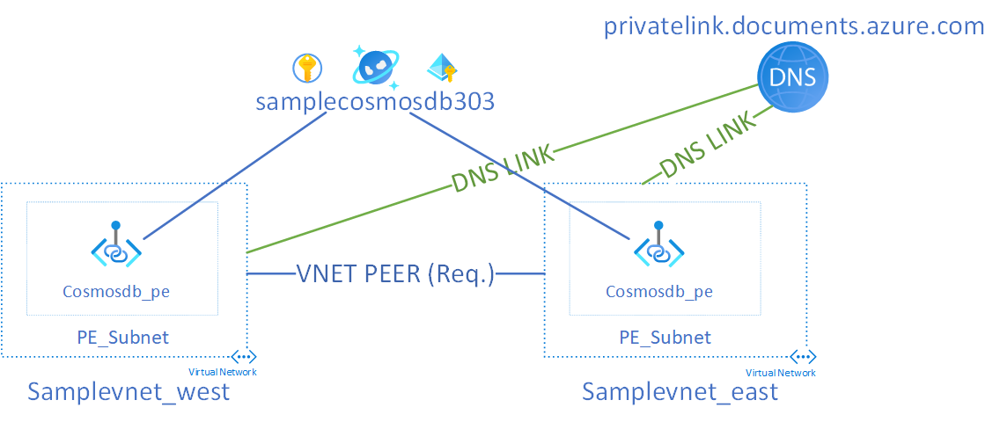

# 303 Cosmos DB SQL API with Read Replica
This template deploys a single region write cosmos db account with a read replica (east and west us regions) with 2 sql databases (autoscale and no autoscale) and 2 containers (per each db), system assigned identity enabled, customer managed keys and private endpoints per each VNET (East2 and West2). There are 2 deployment patterns with private endpoints and cosmosdb: 1) Dual Zone and 2) Single Zone, each with their own pros and cons. Both options are depicted below:
- Single Zone (1 private DNS zone for all regions). This method works if you need hybrid deployment and active-passive setup where you intend to failover from write region to read region. 

- Dual Zone (2x private DNS zone, for each region). This method works well if you are fully cloud-native, but does not work in a hybrid deployment model where you need to resolve from on-premise to Azure. 


This sample will deploy the single zone model. This sample assumes that a resource group has been previously created and is referenced as an input parameter. A sample input parameters file has been included as part of this example.

## Variables 
| Name | Description |
|-|-|
| resource_group_name | Name of existing resource group |
| location | Location where cosmos db will be deployed to | 
| cosmos_account_name | Name of cosmos db account | 
| cosmos_api | API for Cosmos db, should be "sql" in this example | 
| geo_locations | Locations for cosmos db geo replication | 
| sql_dbs | Cosmos SQL DBs to create | 
| sql_db_containers | Cosmos SQL DB containers to create per each db |
| key_vault_name | Name of the existing key vault | 
| key_vault_rg_name | Name of the resource group where key vault exists | 
| key_vault_key_name | Name of the existing key which is going to be used for encryption |  
| enable_systemassigned_identity | True/False flag to enable system assigned identity | 
| virtual_network_name | Virtual Network where cosmos db pe will be created, defaults to samplevnet_303 |
| vnet_address_space | VNET Address Space, defaults to 10.0.0.0/16 | 
| subnet_name | Subnet where cosmos db pe will be created, defaults to pe_subnet| 
| subnet_prefixes | PE Subnet Prefix, defaults to 10.0.0.0/24 | 
| private_dns_vnet_link_name | DNS Zone Link Name for Cosmos DB Private DNS Zone, defaults to sqlapi_zone_link | 
| dns_zone_group_name | Name of the zone group for the pe, defaults to pe_zone_group | 
| pe_name | Name of the private endpoint, defaults to cosmosdb_pe | 
| pe_connection_name | Name of the pe connection, defaults to pe_connection | 
| log_analytics_workspace_name | Log Analytics Workspace Name | 

Please see terraform.tfvars.sample for example inputs. Above is the minimal input requirements for the cosmos db module. 

## Usage
```bash
terraform plan -out example.tfplan
terraform apply example.tfplan
```

# Contribute
This project welcomes contributions and suggestions. Most contributions require you to agree to a Contributor License Agreement (CLA) declaring that you have the right to, and actually do, grant us the rights to use your contribution. For details, visit https://cla.microsoft.com.

When you submit a pull request, a CLA-bot will automatically determine whether you need to provide a CLA and decorate the PR appropriately (e.g., label, comment). Simply follow the instructions provided by the bot. You will only need to do this once across all repos using our CLA.

This project has adopted the Microsoft Open Source Code of Conduct. For more information see the Code of Conduct FAQ or contact opencode@microsoft.com with any additional questions or comments.
