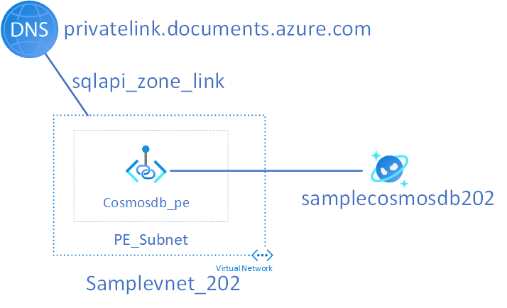

# 202 Cosmos DB SQL API 
This template deploys a cosmos db account with 2 sql databases (autoscale and no autoscale) and 2 containers (per each db) along with a private endpoint. This sample assumes that a resource group, virtual network, subnet and private dns zone has been previously created outside of the module and is referenced as an input parameter. A sample input parameters file has been included as part of this example.



## Variables 
| Name | Description |
|-|-|
| resource_group_name | Name of existing resource group |
| location | Location where cosmos db will be deployed to | 
| cosmos_account_name | Name of cosmos db account | 
| cosmos_api | API for Cosmos db, should be "sql" in this example | 
| sql_dbs | Cosmos SQL DBs to create | 
| sql_db_containers | Cosmos SQL DB containers to create per each db | 
| virtual_network_name | Virtual Network where cosmos db pe will be created, defaults to samplevnet_202 |
| vnet_address_space | VNET Address Space, defaults to 10.0.0.0/16 | 
| subnet_name | Subnet where cosmos db pe will be created, defaults to pe_subnet| 
| subnet_prefixes | PE Subnet Prefix, defaults to 10.0.0.0/24 | 
| private_dns_vnet_link_name | DNS Zone Link Name for Cosmos DB Private DNS Zone, defaults to sqlapi_zone_link | 
| dns_zone_group_name | Name of the zone group for the pe, defaults to pe_zone_group | 
| pe_name | Name of the private endpoint, defaults to cosmosdb_pe | 
| pe_connection_name | Name of the pe connection, defaults to pe_connection | 

Please see terraform.tfvars.sample for example inputs. Above is the minimal input requirements for the cosmos db module. 

## Usage
```bash
terraform plan -out example.tfplan
terraform apply example.tfplan
```

# Contribute
This project welcomes contributions and suggestions. Most contributions require you to agree to a Contributor License Agreement (CLA) declaring that you have the right to, and actually do, grant us the rights to use your contribution. For details, visit https://cla.microsoft.com.

When you submit a pull request, a CLA-bot will automatically determine whether you need to provide a CLA and decorate the PR appropriately (e.g., label, comment). Simply follow the instructions provided by the bot. You will only need to do this once across all repos using our CLA.

This project has adopted the Microsoft Open Source Code of Conduct. For more information see the Code of Conduct FAQ or contact opencode@microsoft.com with any additional questions or comments.
